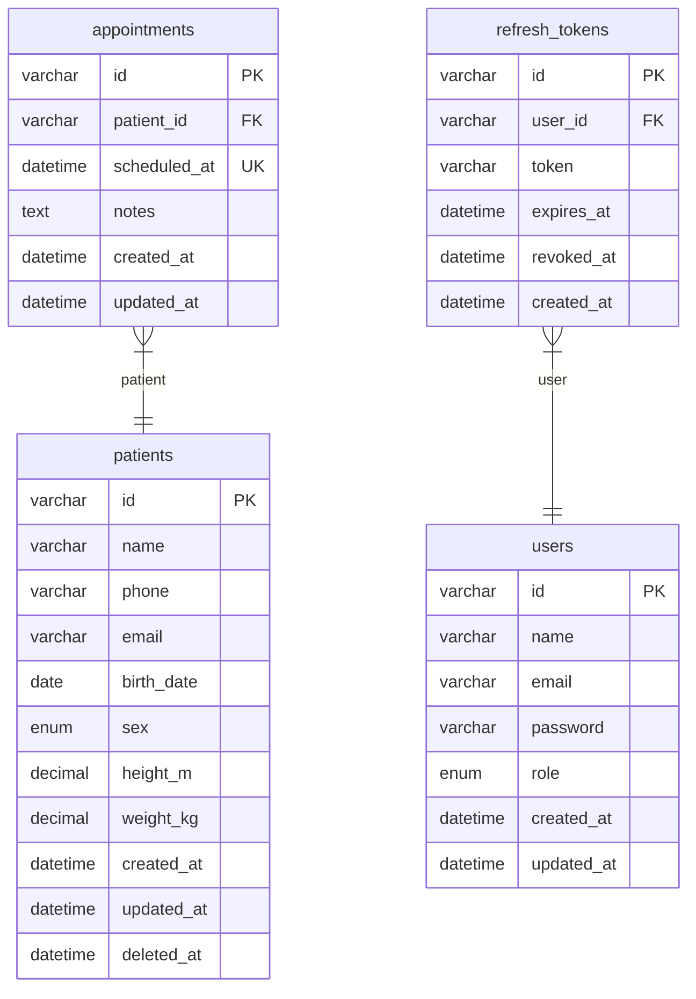

```mermaid
erDiagram
  appointments {
    varchar id PK
    varchar patient_id FK
    datetime scheduled_at UK
    text notes
    datetime created_at
    datetime updated_at
  }
  patients {
    varchar id PK
    varchar name
    varchar phone
    varchar email
    date birth_date
    enum sex
    decimal height_m
    decimal weight_kg
    datetime created_at
    datetime updated_at
    datetime deleted_at
  }
  refresh_tokens {
    varchar id PK
    varchar user_id FK
    varchar token
    datetime expires_at
    datetime revoked_at
    datetime created_at
  }
  users {
    varchar id PK
    varchar name
    varchar email
    varchar password
    enum role
    datetime created_at
    datetime updated_at
  }
  appointments }|--|| patients: patient
  refresh_tokens }|--|| users: user
```
